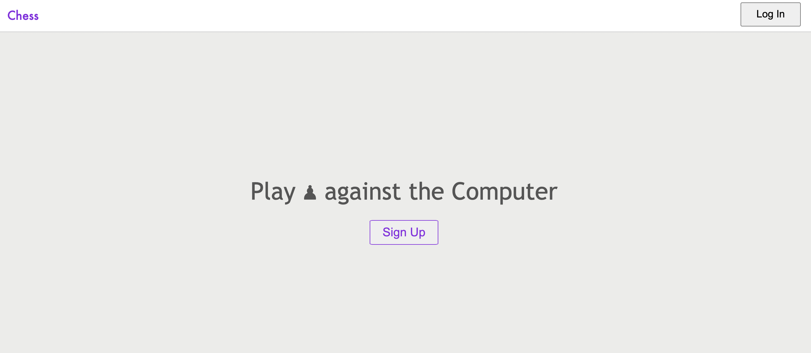
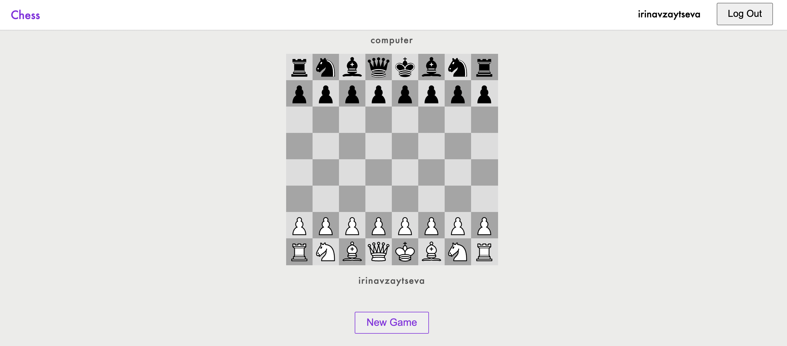

<h1 align="center">Chess</h1>

<h2 align="center">Play live ♟ game against a top chess computer</h2>

Check out the  <a href="https://sparkling-view.surge.sh" target="_blank">website</a>

<h1>👤 User flow</h1>  

1. Make an account  

  

2. Play chess

  

 

<h1>⚙️ Development</h1> 

This project made with:  
 

- [React](https://reactjs.org/)
- [Express](https://expressjs.com/) 
- [Lichess API](https://lichess.org/api) 
- [Auth0](hhttps://auth0.com/) 
- [PostgreSQL](https://www.postgresql.org/) 
  
 

To run the project, you need to create a <code>.env</code> with following variables:  

- Frontend 
<pre>
REACT_APP_AUTH0_DOMAIN= ...
REACT_APP_AUTH0_CLIENT_ID= ...
</pre>

- Backend 
<pre>
LICHESS_TOKEN= ...
SECRET_KEY= ...
</pre>

 
In order to deploy the project, you can create account on Heroku and after install add-ons: Heroku Postgres
 
 

➡️  This is the capstone project 3 for the course Software Engineering at Springboard
 